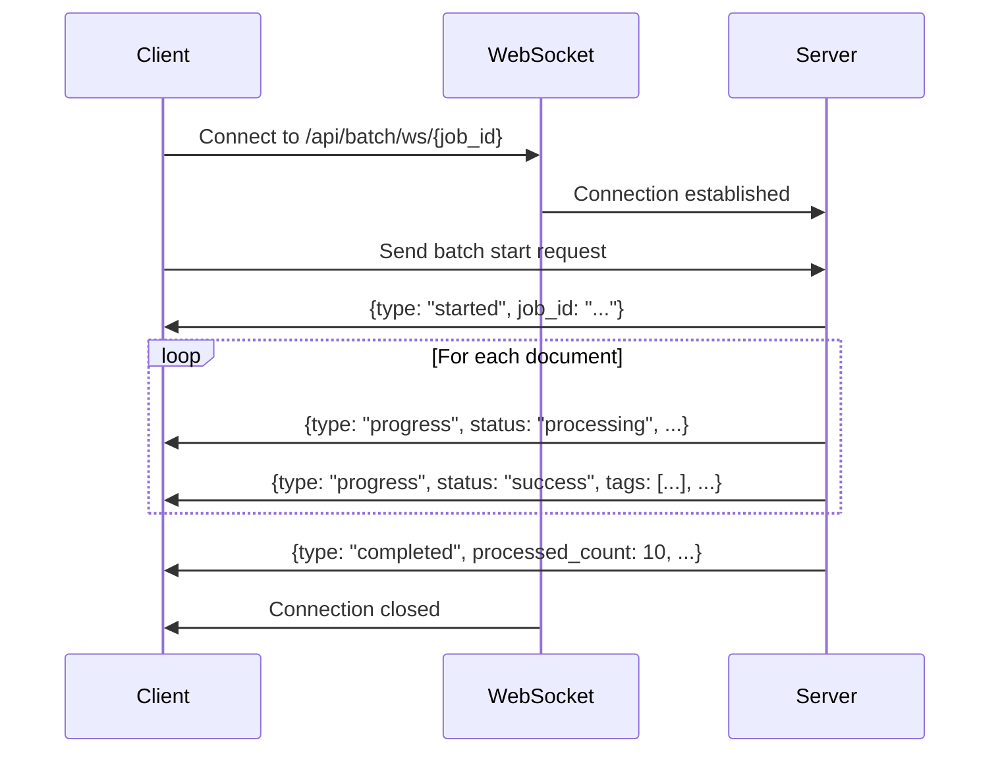

## Overview

Batch processing enables you to process hundreds of documents simultaneously with **real-time progress tracking** via WebSocket connections. Upload a CSV or Excel file with document metadata, validate paths, and watch as each document is processed with live status updates.

<Info>
Batch processing uses **WebSocket** for real-time updates, allowing you to monitor progress, pause processing, and export results without waiting for the entire batch to complete.
</Info>

## Workflow

<Steps>
  <Step title="Upload CSV or Excel File">
    Upload a file containing your document metadata:
    
    **Supported Formats**
    - `.csv` (CSV files)
    - `.xlsx` (Excel 2007+)
    - `.xls` (Legacy Excel)
    
    **Drag & Drop**
    ```tsx
    // Drop zone accepts multiple formats
    <input type="file" accept=".csv,.xlsx,.xls" />
    ```
    
    After upload, the system automatically:
    - Parses CSV with PapaParse
    - Reads Excel with SheetJS (XLSX library)
    - Detects column headers
    - Maps system fields (title, file_path, file_source_type, description)
    - Generates unique row IDs
    
    <Note>
    **Excel Tip**: Paste URLs as plain text. Excel hyperlinks (blue underlined links) will not work as expected.
    </Note>
  </Step>
  
  <Step title="Review & Edit Spreadsheet">
    An interactive spreadsheet editor displays your data:
    
    **Features**
    - **Inline editing**: Click any cell to edit
    - **Column management**: Add, remove, rename, reorder columns
    - **Row actions**: Add new rows, delete rows, bulk update
    - **Column mapping**: Map your columns to required system fields
    - **Visual status**: Color-coded row status (pending, processing, success, failed)
    
    **Required Fields**
    <Checklist>
      <li>**file_path**: URL or file location (required)</li>
      <li>**title**: Document name (optional but recommended)</li>
      <li>**file_source_type**: `url`, `s3`, or `local` (optional, auto-detected)</li>
      <li>**description**: Document description (optional)</li>
    </Checklist>
  </Step>
  
  <Step title="Run Pre-flight Path Validation">
    Before processing, validate all file paths:
    
    ```bash
    POST /api/batch/validate-paths
    ```
    
    **What It Checks**
    - **URL paths**: HTTP HEAD request (falls back to GET if HEAD not allowed)
    - **S3 paths**: AWS SDK `head_object()` check (requires S3 config)
    - **Local paths**: File system existence check
    
    **Validation Results**
    ```json
    {
      "results": [
        {
          "path": "https://example.com/doc.pdf",
          "valid": true,
          "error": null,
          "content_type": "application/pdf",
          "size": 1024000
        },
        {
          "path": "https://example.com/missing.pdf",
          "valid": false,
          "error": "404 Not Found",
          "content_type": null,
          "size": null
        }
      ],
      "total": 2,
      "valid_count": 1,
      "invalid_count": 1
    }
    ```
    
    <Warning>
    Invalid paths are highlighted in red in the spreadsheet. Fix them before starting processing to avoid failures.
    </Warning>
  </Step>
  
  <Step title="Configure Processing Settings">
    Set global processing options:
    
    - **OpenRouter API Key** (required)
    - **Model Name** (e.g., `openai/gpt-4o-mini`, `google/gemini-flash-1.5`)
    - **Number of Pages**: Pages to extract per document (default: 3)
    - **Number of Tags**: Target tags per document (default: 8)
    - **Exclusion Words**: Optional array of terms to filter
  </Step>
  
  <Step title="Start Real-Time Processing">
    Click **Start Processing** to begin:
    
    1. System generates a unique `job_id`
    2. WebSocket connection opens: `wss://api.example.com/api/batch/ws/{job_id}`
    3. Client sends batch start request with documents and config
    4. Server processes documents sequentially
    5. Each document sends progress update via WebSocket
    6. Client updates UI in real-time
    7. Completion message sent when all documents finish
    
    **Stop Anytime**
    - Click **Stop Processing** to gracefully halt
    - Already-processed documents are preserved
    - Partial results can be exported
  </Step>
  
  <Step title="Export Results">
    Export processed data in multiple formats:
    
    - **CSV**: Comma-separated values
    - **Excel**: `.xlsx` with formatted columns
    - **JSON**: Machine-readable format
    
    **Export Options**
    - Select which columns to include
    - Rename columns for export
    - Save export presets for reuse
    - Filter rows before export (e.g., only successful)
  </Step>
</Steps>

## Real-Time WebSocket Updates

### Connection Flow



### Message Types

<Tabs>
  <Tab title="Started Message">
    Confirms job initialization:
    
    ```json
    {
      "type": "started",
      "job_id": "550e8400-e29b-41d4-a716-446655440000",
      "total_documents": 10,
      "message": "Batch processing started"
    }
    ```
  </Tab>
  
  <Tab title="Progress Update">
    Sent for each document as it's processed:
    
    ```json
    {
      "job_id": "550e8400-e29b-41d4-a716-446655440000",
      "row_id": "row-uuid-123",
      "row_number": 1,
      "title": "Training Manual 2024",
      "status": "success",
      "progress": 0.1,
      "tags": ["pmkvy", "skill-development", "2024"],
      "error": null,
      "metadata": {
        "extraction_method": "pypdf2",
        "is_scanned": false,
        "ocr_confidence": null,
        "processing_time": 3.4,
        "detected_language": "en",
        "language_name": "English"
      }
    }
    ```
    
    **Status Values**
    - `processing`: Currently being processed
    - `success`: Tags generated successfully
    - `failed`: Error occurred (see `error` field)
  </Tab>
  
  <Tab title="Completion Message">
    Sent when all documents finish:
    
    ```json
    {
      "type": "completed",
      "job_id": "550e8400-e29b-41d4-a716-446655440000",
      "total_documents": 10,
      "processed_count": 9,
      "failed_count": 1,
      "processing_time": 45.2,
      "message": "Completed: 9 succeeded, 1 failed"
    }
    ```
  </Tab>
  
  <Tab title="Error Message">
    Sent when job-level error occurs:
    
    ```json
    {
      "type": "error",
      "job_id": "550e8400-e29b-41d4-a716-446655440000",
      "error": "WebSocket connection lost",
      "message": "An error occurred during processing"
    }
    ```
  </Tab>
</Tabs>

### Client-Side State Management

The batch store (Zustand) manages WebSocket state:

```typescript
// WebSocket connection
websocket: WebSocket | null

// Update handler receives messages
updateProgress: (update: any) => {
  if (update.type === 'progress') {
    // Find document by row_id and update
    const doc = documents.find(d => d.id === update.row_id)
    doc.status = update.status
    doc.tags = update.tags
    doc.metadata = update.metadata
  }
}
```

## Interactive Spreadsheet Editor

### Column Management

<CardGroup cols={2}>
  <Card title="Add Column" icon="plus">
    Add custom columns for additional metadata:
    
    ```tsx
    addColumn('custom_field', afterColumnId)
    ```
    
    New columns appear in the editor and can be included in exports.
  </Card>
  
  <Card title="Remove Column" icon="trash">
    Delete columns you don't need:
    
    ```tsx
    removeColumn(columnId)
    ```
    
    System columns (file_path, title) cannot be removed.
  </Card>
  
  <Card title="Rename Column" icon="pen">
    Change display names:
    
    ```tsx
    renameColumn(columnId, 'New Name')
    ```
    
    Preserves original CSV column names for reference.
  </Card>
  
  <Card title="Reorder Columns" icon="arrows-left-right">
    Drag columns to reorder:
    
    ```tsx
    reorderColumns([colId1, colId3, colId2])
    ```
    
    Position updates are instant.
  </Card>
</CardGroup>

### Row Operations

**Update Single Cell**
```tsx
// Click to edit any cell
updateRowData(rowId, columnId, newValue)
```

**Bulk Update**
```tsx
// Update multiple rows at once
bulkUpdateRows(rowIds, 'status', 'pending')
```

**Add New Row**
```tsx
// Append blank row to bottom
addRow()
```

**Delete Rows**
```tsx
// Remove selected rows
deleteRows([rowId1, rowId2, rowId3])
```

### Column Mapping Panel

Maps your CSV columns to system fields:

<Accordion title="Column Mapping Details">
  **System Fields**
  - `title` → Document title
  - `file_path` → URL or file location (required)
  - `file_source_type` → Source type: `url`, `s3`, `local`
  - `description` → Document description
  
  **Auto-Detection**
  
  The system attempts fuzzy matching:
  ```typescript
  // Example: "Document Name" maps to "title"
  // Example: "PDF Link" maps to "file_path"
  // Example: "Type" maps to "file_source_type"
  ```
  
  **Manual Mapping**
  
  Use dropdowns to map columns if auto-detection fails.
</Accordion>

## Processing Controls

### Pre-flight Validation

**Validate Paths Button**
- Checks all `file_path` values before processing
- Displays summary: X valid, Y invalid
- Highlights invalid paths in red in spreadsheet
- Disabled during processing

**Validation Stats**
```tsx
<div className="flex gap-4">
  <span className="text-green-600">✓ {validCount} valid</span>
  <span className="text-red-600">⚠️ {invalidCount} invalid</span>
</div>
```

### Start/Stop Processing

**Start Processing Button**
- Validates API key before starting
- Confirms required columns are mapped
- Opens WebSocket connection
- Sends initial batch request
- Shows processing stats in real-time

**Stop Processing Button**
- Gracefully closes WebSocket
- Preserves partial results
- Allows resuming later (manual CSV re-upload)

### Processing Stats Display

<CodeGroup>
```tsx Grid Layout
<div className="grid grid-cols-3 gap-3">
  <div className="p-3 bg-gray-50 rounded-lg">
    <p className="text-2xl font-bold">{documents.length}</p>
    <p className="text-xs text-gray-500">Total</p>
  </div>
  <div className="p-3 bg-green-50 rounded-lg">
    <p className="text-2xl font-bold text-green-700">{successCount}</p>
    <p className="text-xs text-green-600">Success</p>
  </div>
  <div className="p-3 bg-red-50 rounded-lg">
    <p className="text-2xl font-bold text-red-700">{failedCount}</p>
    <p className="text-xs text-red-600">Failed</p>
  </div>
</div>
```
</CodeGroup>

## CSV Template

### Download Template

**Endpoint**: `GET /api/batch/template`

Returns a sample CSV with:
- Column headers with descriptions
- Example rows showing correct format
- Comments explaining each field

**Example Template**
```csv
title,description,file_source_type,file_path,publishing_date,file_size
"Training Manual","PMSPECIAL training document",url,https://example.com/doc1.pdf,2025-01-15,1.2MB
"Policy Guidelines","Government policy document",url,https://example.com/doc2.pdf,2025-01-20,850KB
"Annual Report","2024 annual report",s3,s3://my-bucket/reports/2024.pdf,2024-12-31,3.5MB
```

### Column Descriptions

<Tabs>
  <Tab title="file_path (Required)">
    **Description**: Path or URL to the PDF file
    
    **Examples**:
    - `https://example.com/document.pdf`
    - `https://d1581jr3fp95xu.cloudfront.net/path/to/file.pdf`
    - `s3://bucket-name/folder/file.pdf`
    - `/local/path/to/file.pdf`
    
    **Validation**: Must be non-empty, accessible URL or valid path
  </Tab>
  
  <Tab title="title (Optional)">
    **Description**: Document title or name
    
    **Examples**:
    - `"Training Manual 2024"`
    - `"Policy Guidelines - Revised"`
    - `"Q1 Financial Report"`
    
    **Fallback**: If not provided, extracted from PDF metadata or content
  </Tab>
  
  <Tab title="file_source_type (Optional)">
    **Description**: Source type for the file
    
    **Values**:
    - `url`: HTTP/HTTPS URL
    - `s3`: AWS S3 path
    - `local`: Local file system path
    
    **Auto-Detection**: System infers from `file_path` if not provided
  </Tab>
  
  <Tab title="description (Optional)">
    **Description**: Document description or summary
    
    **Examples**:
    - `"PMSPECIAL training document for skill development"`
    - `"Government policy on social welfare schemes"`
    - `"Annual report covering fiscal year 2024"`
    
    **Use**: Provides additional context for AI tagging
  </Tab>
  
  <Tab title="publishing_date (Optional)">
    **Description**: Publication date
    
    **Format**: Any common date format (ISO 8601 recommended)
    
    **Examples**:
    - `2025-01-15`
    - `01/15/2025`
    - `15-Jan-2025`
  </Tab>
  
  <Tab title="file_size (Optional)">
    **Description**: File size
    
    **Format**: Human-readable or bytes
    
    **Examples**:
    - `1.2MB`
    - `850KB`
    - `1234567` (bytes)
  </Tab>
</Tabs>

## Export Options

### Export Formats

<CardGroup cols={3}>
  <Card title="CSV Export" icon="file-csv">
    Comma-separated values:
    
    - Standard CSV format
    - UTF-8 encoding
    - Quoted fields
    - Compatible with Excel, Google Sheets
  </Card>
  
  <Card title="Excel Export" icon="file-excel">
    Excel workbook (`.xlsx`):
    
    - Formatted columns
    - Auto-sized widths
    - Header row styling
    - Opens directly in Excel
  </Card>
  
  <Card title="JSON Export" icon="file-code">
    Machine-readable JSON:
    
    - Array of objects
    - Nested metadata
    - Tags as arrays
    - Perfect for APIs
  </Card>
</CardGroup>

### Export Presets

Save common export configurations:

```typescript
interface ExportPreset {
  id: string
  name: string
  selectedColumns: string[]           // Column IDs to include
  columnRenames: Record<string, string>  // Column ID → export name
  format: 'csv' | 'excel' | 'json'
}
```

**Use Cases**
- **ElasticSearch Format**: Export only title, tags, file_path with custom names
- **Full Data**: Export all columns including metadata
- **Summary**: Export only title, tags, status

## Error Handling

### Error Types

<AccordionGroup>
  <Accordion title="Rate Limit Errors">
    **Detection**:
    ```typescript
    if (msg.includes('429') || msg.includes('rate limit')) {
      errorType = 'rate-limit'
    }
    ```
    
    **Handling**:
    - Document marked as `failed`
    - Error message stored in `error` field
    - Processing continues to next document
    - User can retry failed documents later
    
    **Solutions**:
    - Reduce processing speed
    - Use different API key with higher rate limits
    - Upgrade OpenRouter plan
  </Accordion>
  
  <Accordion title="Model Errors">
    **Detection**:
    ```typescript
    if (msg.includes('400') || msg.includes('bad request')) {
      errorType = 'model-error'
    }
    ```
    
    **Common Causes**:
    - Invalid model name
    - Model doesn't support requested parameters
    - Input too long for model context window
    
    **Solutions**:
    - Verify model name spelling
    - Try different model (e.g., switch to Gemini from GPT)
    - Reduce `num_pages` to shorten input
  </Accordion>
  
  <Accordion title="Network Errors">
    **Detection**:
    ```typescript
    if (msg.includes('connection') || msg.includes('timeout')) {
      errorType = 'network'
    }
    ```
    
    **Handling**:
    - WebSocket reconnection attempted
    - Document retry logic
    - Timeout warnings
    
    **Solutions**:
    - Check network connectivity
    - Verify firewall allows WebSocket connections
    - Reduce document size
  </Accordion>
  
  <Accordion title="Path Validation Errors">
    **Detection**: Pre-flight validation marks paths as invalid
    
    **Common Issues**:
    - URL returns 404 (file not found)
    - URL requires authentication
    - S3 object doesn't exist
    - Local file missing
    
    **Solutions**:
    - Fix URLs in spreadsheet before processing
    - Ensure S3 credentials configured (for S3 paths)
    - Verify file permissions (for local paths)
  </Accordion>
</AccordionGroup>

## Performance Optimization

<Tip>
**Process faster**:
- Use `google/gemini-flash-1.5` (fastest model)
- Reduce `num_pages` to 1-2
- Process text-based PDFs (avoid scanned documents)
- Use URL paths (faster than local file reads)
</Tip>

<Tip>
**Handle large batches**:
- Start with small test batch (10-20 documents)
- Monitor for rate limits
- Use pre-flight validation to catch errors early
- Export partial results periodically
</Tip>

<Warning>
**Avoid common pitfalls**:
- Don't include Excel hyperlinks (paste as plain text)
- Don't mix file types in `file_path` column
- Don't use relative paths (use absolute URLs)
- Don't exceed API rate limits (add delays if needed)
</Warning>

## Best Practices

<Steps>
  <Step title="Prepare Your CSV">
    - Use template as starting point
    - Ensure `file_path` column has valid URLs
    - Add descriptive titles for better tagging
    - Include descriptions for context
  </Step>
  
  <Step title="Validate Before Processing">
    - Always run pre-flight validation
    - Fix invalid paths before starting
    - Review column mapping
  </Step>
  
  <Step title="Monitor Progress">
    - Watch real-time updates for errors
    - Stop processing if many documents fail
    - Check error messages for patterns
  </Step>
  
  <Step title="Export Results">
    - Export partial results during long batches
    - Save export presets for reuse
    - Choose appropriate format for your use case
  </Step>
</Steps>