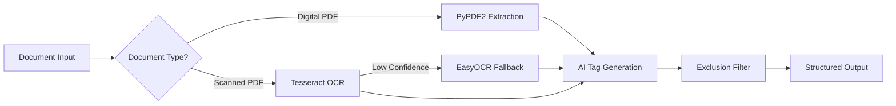

## Transform Documents Into Searchable Knowledge

Meta-Data Tag Generator is an AI-powered system that automatically extracts meaningful metadata tags from documents, making them instantly searchable and discoverable. Whether you're processing government reports, legal documents, or multilingual archives, our hybrid OCR approach ensures accurate text extraction and intelligent tag generation.

## Key Features

<CardGroup cols={2}>
  <Card
    title="AI-Powered Tagging"
    icon="brain"
    href="/guides/ai-models"
  >
    Generate contextual metadata tags using OpenRouter API with support for multiple AI models including GPT-4, Gemini, and Claude
  </Card>
  <Card
    title="Hybrid OCR System"
    icon="text"
    href="/features/ocr-support"
  >
    Three-tier extraction: PyPDF2 for digital PDFs, Tesseract for fast OCR, and EasyOCR for complex scripts with 80+ language support
  </Card>
  <Card
    title="Batch Processing"
    icon="server"
    href="/features/batch-processing"
  >
    Process hundreds of documents with real-time WebSocket progress updates and intelligent rate limiting
  </Card>
  <Card
    title="Multilingual Support"
    icon="globe"
    href="/features/ocr-support"
  >
    Support for all Indian languages including Hindi, Tamil, Telugu, Bengali, Kannada, Malayalam, Marathi, and more
  </Card>
  <Card
    title="Smart Filtering"
    icon="filter"
    href="/features/exclusion-lists"
  >
    Use exclusion lists to filter out generic terms and ensure tags are specific and meaningful for search
  </Card>
  <Card
    title="Flexible Input"
    icon="link"
    href="/features/url-processing"
  >
    Process documents from file uploads, public URLs, CloudFront, S3, or batch CSV with automatic validation
  </Card>
</CardGroup>

## How It Works

<Steps>
  <Step title="Upload Your Document">
    Upload a PDF file directly or provide a URL to a publicly accessible document. Supports CloudFront, S3, and standard HTTP/HTTPS URLs.
  </Step>
  
  <Step title="Configure AI Settings">
    Enter your OpenRouter API key, select your preferred AI model (GPT-4, Gemini, Claude, etc.), and set the number of tags to generate.
  </Step>
  
  <Step title="Optional: Add Exclusion List">
    Upload a text or PDF file containing terms to exclude from tag generation, ensuring tags are specific to your domain.
  </Step>
  
  <Step title="Process & Extract">
    The system automatically detects if your document is scanned and applies the optimal OCR method:
    - **Digital PDFs**: Fast text extraction with PyPDF2
    - **Scanned PDFs (English/Hindi)**: Tesseract OCR for speed
    - **Complex Scripts**: Automatic fallback to EasyOCR for accuracy
  </Step>
  
  <Step title="Generate Tags">
    AI analyzes the extracted text and generates contextual metadata tags categorized into:
    - **Names**: Specific entities, programs, organizations
    - **Subjects**: Topics, beneficiaries, domains
    - **Actions**: Purpose, document type, context
  </Step>
  
  <Step title="Export & Use">
    Download results as CSV or JSON with complete metadata including extraction method, OCR confidence, and processing time.
  </Step>
</Steps>

## Technical Architecture

<Note>
  The system uses a **3-tier extraction strategy** to balance speed and accuracy. Digital PDFs are processed in under 2 seconds, while scanned documents may take 10-30 seconds depending on complexity.
</Note>

## Use Cases

<AccordionGroup>
  <Accordion title="Government Document Archives">
    Tag thousands of policy documents, circulars, and reports with metadata for easy search and retrieval. Automatically extracts scheme names, notification numbers, and ministry information.
  </Accordion>
  
  <Accordion title="Legal Document Management">
    Process legal documents with automatic extraction of act names, section numbers, and case references. Supports both English and regional language documents.
  </Accordion>
  
  <Accordion title="Research Paper Indexing">
    Generate keywords and metadata tags for academic papers, technical reports, and research publications. Supports multilingual content.
  </Accordion>
  
  <Accordion title="Digital Library Enhancement">
    Enhance existing digital libraries with searchable metadata tags. Batch process entire collections with CSV import/export.
  </Accordion>
</AccordionGroup>

## Supported Languages

Our hybrid OCR system supports **80+ languages** including:

<CardGroup cols={3}>
  <Card title="Indian Languages">
    - Hindi (हिन्दी)
    - Tamil (தமிழ்)
    - Telugu (తెలుగు)
    - Bengali (বাংলা)
    - Kannada (ಕನ್ನಡ)
    - Malayalam (മലയാളം)
    - Marathi (मराठी)
    - Gujarati (ગુજરાતી)
    - Punjabi (ਪੰਜਾਬੀ)
    - Odia (ଓଡ଼ିଆ)
  </Card>
  
  <Card title="International">
    - English
    - Spanish
    - French
    - German
    - Chinese
    - Japanese
    - Korean
    - Arabic
    - Russian
    - And 60+ more
  </Card>
  
  <Card title="Mixed Language">
    Documents with multiple languages are automatically detected and processed correctly with language-aware tag generation.
  </Card>
</CardGroup>

## Quick Start

<CardGroup cols={2}>
  <Card
    title="Installation"
    icon="docker"
    href="/installation"
  >
    Get started with Docker Compose in under 5 minutes
  </Card>
  <Card
    title="Quick Start Guide"
    icon="rocket"
    href="/quickstart"
  >
    Process your first document and understand the workflow
  </Card>
</CardGroup>

## System Requirements

<CardGroup cols={2}>
  <Card title="Minimum">
    - 2 CPU cores
    - 4GB RAM
    - 5GB disk space
    - Docker & Docker Compose
  </Card>
  
  <Card title="Recommended">
    - 4+ CPU cores
    - 8GB+ RAM
    - 20GB disk space
    - SSD storage for database
  </Card>
</CardGroup>

<Warning>
  EasyOCR models require significant memory when processing complex scripts. For batch processing of scanned documents, we recommend at least 8GB RAM.
</Warning>

## What's Next?

<CardGroup cols={3}>
  <Card
    title="Installation"
    icon="download"
    href="/installation"
  >
    Set up the system using Docker Compose
  </Card>
  <Card
    title="Quick Start"
    icon="play"
    href="/quickstart"
  >
    Process your first document in minutes
  </Card>
  <Card
    title="API Reference"
    icon="code"
    href="/api/overview"
  >
    Integrate with your applications
  </Card>
</CardGroup>
